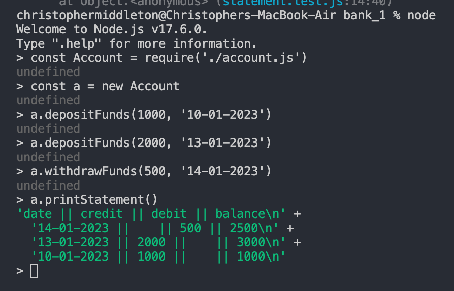
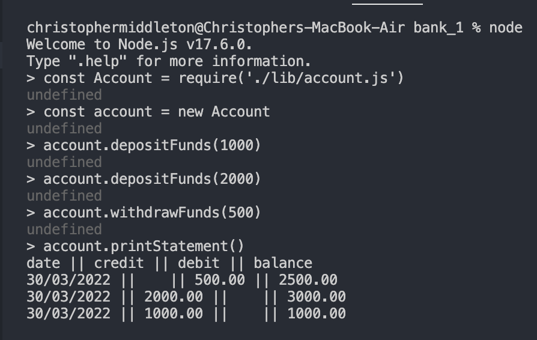

### Requirements

You should be able to interact with your code via a REPL like IRB or Node. (You don't need to implement a command line interface that takes input from STDIN.  
Deposits, withdrawal.  
Account statement (date, amount, balance) printing.  
Data can be kept in memory (it doesn't need to be stored to a database or anything).  

### Acceptance criteria
Given a client makes a deposit of 1000 on 10-01-2023  
And a deposit of 2000 on 13-01-2023  
And a withdrawal of 500 on 14-01-2023   
When she prints her bank statement  
Then she would see:
```
date || credit || debit || balance
14/01/2023 || || 500.00 || 2500.00
13/01/2023 || 2000.00 || || 3000.00
10/01/2023 || 1000.00 || || 1000.00
```

## Planning

Key Nouns (classes):
1. Account (has a balance, has a transaction log an array of transcation objects)
2. Statement (iterates over then transaction log, and prints stored info in a particular way)
3. Transation (4 attributes (date, credit, debit, balance))

Key Verbs (methods):
1. Deposit - instantiate a transaction object
2. Withdrawal - instantiate a transaction object
3. Print Statement - instantiate a statement object


## To Run:

- run 'npm init -y' and 'npm install' to install environmnet and dependancies
- open Node in terminal
- require the account.js file with the following command :
```
const Account = require('./account')
```
- make an instance of the Account Class
-  to deposit funds call 'despositFunds(amount)', passing the deposit amount as argument.
-  to deposit funds call 'withdrawFunds(amount)', passing the withdrawal amount as argument.
- to print statement call ' printStatement()', with no arguments


Please see an example of the met acceptance criteria, before submission and feeback: 




### Further Development

- have incororporated a automated and formatted date on transcations
- have sucessfully isolated this in testing

## Feedback after first submission & actions to address:

- Automate the date input using JSDate object - implemented and mocked within tests
- Missing decimal points from acceptance criteria - implented by parseFloat function
- Formal syntax '\n' visible in printed statement - altered so that the statement is logged to console, and breaks lines where instructed.
- Use whole words, not figures or letters when running examples in node - corrected as seen in new screen shot
- Reorganise files separating test and logic - implemented spec and lib files
- Further refactor suggested to separate out concerns in Transaction class - date & integer formating have been integrated into Transcation class
- Further refactor suggested to separate out conerns in Statement class - all formatting and printing have been integrated into Statement class.
- Mosts tests rely on state; make use of different jest matchers to diversify testing suites and test more behavioural returns - IN PROGRESS

Please see an example of the met acceptance criteria, before submission and feeback: 




